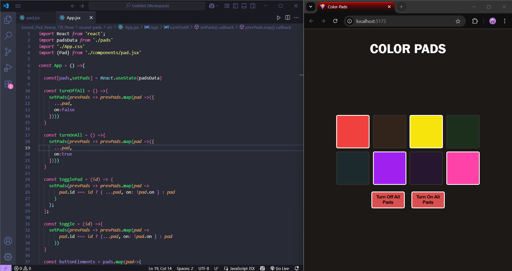
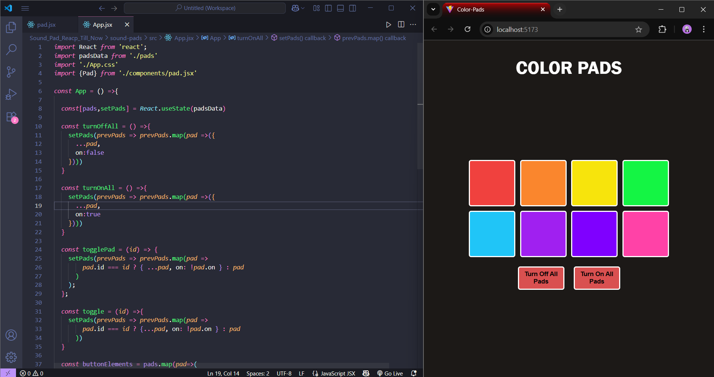
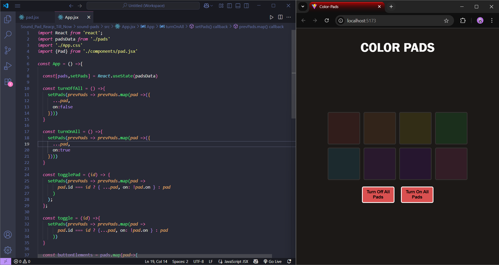
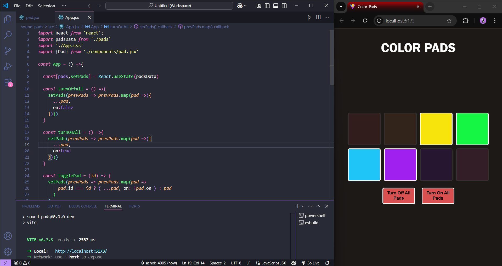

# COLOR PADS

This project has been built to explore basic state management techniques in React, such as how individual components can maintain their own state and also share state with a parent component.

The React app consists of eight div elements arranged in a grid. Each div has its own individual state, which can be changed independently. Additionally, there is a button that can update the state of all the divs at once. Initially, each div is assigned a boolean value from an external array, with each div having a unique ID. The boolean values can be toggled using the useState hook.

# #React  #React State Management

The Initial pads withe default boolean values from the array.

Toggling ON all div's boolean value to true

Toggling OFF all div's boolean value to false

Toggling Indivial div's boolean value to either false or true

